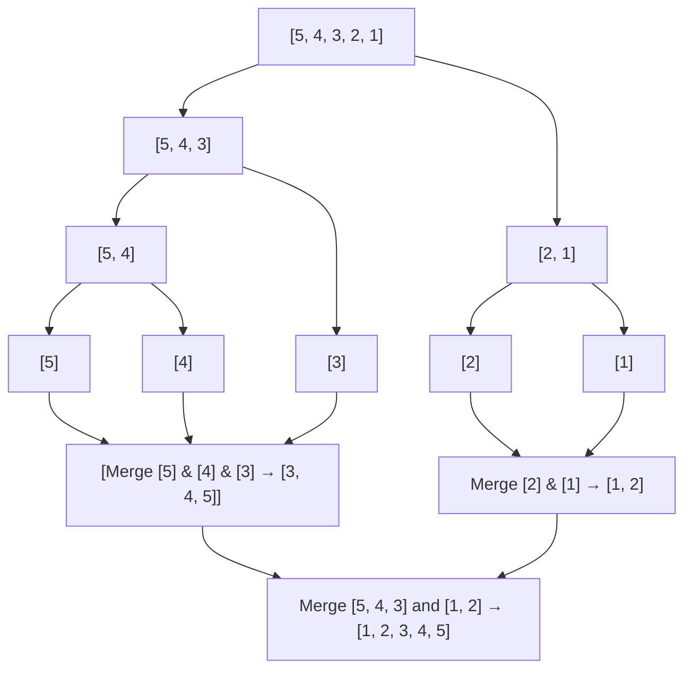

# Merge sort Algorithm

*bangers heard during this notes creation(lol): [Unwritten](https://www.youtube.com/watch?v=b7k0a5hYnSI), [instant Crush]()*
## Explanation
This algorithm is based on the divide and conquer methodology in which we "recurse" one or more times to handle closely related subproblems. they break the problem into several subproblems that are similar to the original problem but are smaller in size, solve the problem recursively, and then combine these solutions to the original problem.

How I understood recursion, metaphorically, it's more like russian dolls, when you open the biggest doll(the top array) then you go down, then down, and this uses a more of a stack metaphor in which you have the big stack(the top doll) and pile them from the smallest doll that you reached ( the smallest one which can't open) to get the final set of the russian dolls( the solution when you rearrange them).

This algorithm has a upper bound case of Θ(n log n) in which it has the following passing cases to reach this conclusion:

1. Division:
- each recursive call splits the array into two halves
- the division process creates a binary tree of height log n since (since you halve n until reaching 1)
2. Merging phase:
- at each level of the tree, merging all subarrays takes Θ(n) time (each element is processed once per level).


total work = height X work per level = log n X n (if don't get it I'll try to explain it in the pseudocode in slang terms)

if you want to be like a mathematician about it, here is divide-and-conquer recurrence or the master theorem recurrence. This reference if from [CLRS](../../../books/algorithms/Introduction.to.Algorithms.4th.Leiserson.Stein.Rivest.Cormen.MIT.Press.9780262046305.EBooksWorld.ir.pdf).

The recurrence relation for merge sort is:

$$
    T(n) = 2T\left(\frac{n}{2}\right) + \Theta(n)
$$

and after applying the master theorem(trust me read [CLRS](../../../books/algorithms/Introduction.to.Algorithms.4th.Leiserson.Stein.Rivest.Cormen.MIT.Press.9780262046305.EBooksWorld.ir.pdf) and search master theorem and also read chapter 3, it'll will help):

$$
    T(n) = \Theta(n \log n)
$$
## pseudocode
So here is the pseudocode and if you want to critique or recommend a study case please submit a issue and I'll appreciate it.

Based on my explanation above, here is how I understood the flow process




We take the array, split it till it reaches to one digit ( people call this the base case), then we pass it through a "merger" that will check the position of the original array.

We then check if the digit is bigger than the number in that the position then replaces it and the repetitive sequence.

We have to keep in mind that we have three indices that we are tracking, left(starting index), mid(the middle index), right(the last index).

Based on the pseudocode, I used CLRS format in which:
- left - p
- mid - q
- right - r


this the recursion procedure named merge_sort:
```
PROCEDURE merge_sort(array, p, r):
    IF p >= r:  // Base case: subarray has 0 or 1 element
        RETURN
    q = floor((p + r) / 2)  // Midpoint
    merge_sort(array, p, q)      // Recursively sort left half
    merge_sort(array, q + 1, r)  // Recursively sort right half
    merge(array, p, q, r)        // Merge sorted halves


```

this is the linear procedure for the merger of the values:
```
PROCEDURE merge(array, p, q, r):
    n1 = q - p + 1  // Size of left subarray
    n2 = r - q      // Size of right subarray
    CREATE L[0..n1-1], R[0..n2-1]  // Temporary arrays
    
    // Copy data to L and R
    FOR i FROM 0 TO n1-1:
        L[i] = array[p + i]
    FOR j FROM 0 TO n2-1:
        R[j] = array[q + 1 + j]
    
    // Merge L and R back into array
    i = 0  // Index for L
    j = 0  // Index for R
    k = p  // Index for merged array
    
    WHILE i < n1 AND j < n2:
        IF L[i] <= R[j]:
            array[k] = L[i]
            i = i + 1
        ELSE:
            array[k] = R[j]
            j = j + 1
        k = k + 1
    
    // Copy remaining elements of L (if any)
    WHILE i < n1:
        array[k] = L[i]
        i = i + 1
        k = k + 1
    
    // Copy remaining elements of R (if any)
    WHILE j < n2:
        array[k] = R[j]
        j = j + 1
        k = k + 1
```
## C implementation

To find the implementation code in C, click [here](../merge-sort/merge-sort.c)

### Notes

This are the findings I found:
- use size_t for unsigned values in which we use more space instead of using signed values. Reference from [modernC](../../../books/programming/modernC.pdf)
- For the middle index creation I did like this in the beginning:
```C
int q = (p + r) / 2;
```
it is correct but in C, there is this thing called integer overflow in which we could do this but I can have an issue with integer overflow where it could give me an ambiguous value then give me a wrong value. so I have to implement "defense programming" where I implemented this:

```C
int q = p + (r - p) / 2;
```

- This is based on an error I got in the merger function:
```C
    int i ;
    int j ;
    int k = p;
```
I found out that this is really bad because it may lead to the integer to initialize with garbage(literally). It leads to undefined behaviour so you have to this correct order.
```C
    int i = 0;
    int j = 0;
    int k = p;
```

- The pseudocode assumes that the indices of p,q and r are 1. Well I did that intentionally cause you'd copy if you didn't read these notes but computers start at 0. Reference from [ARM](../../../books/system%20programming/Introduction%20to%20Assembly%20Language%20Programming_%20From%20Soup%20to%20Nuts_.pdf)